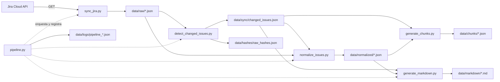

<div align="center">

# ⚡ RAG  · Jira Extraction Pipeline

### De Jira a conocimiento estructurado, trazable y listo para RAG

Pipeline **read-only** en Python que sincroniza tarjetas de Jira, detecta cambios,
normaliza la información y genera documentos Markdown preparados para búsqueda,
chunking e integración con soluciones de IA.


</div>

---

## ✨ ¿Qué hace este proyecto?

RAG  transforma información de Jira en archivos locales claros, consistentes
y fáciles de consumir por personas o sistemas de recuperación aumentada por
generación (**RAG**).

Con un solo comando, el pipeline:

1. Consulta tarjetas del proyecto configurado en Jira.
2. Guarda la respuesta completa de cada tarjeta como JSON raw.
3. Detecta cuáles son nuevas o cambiaron desde la última corrida.
4. Normaliza campos, usuarios, comentarios, adjuntos, relaciones e historial.
5. Genera un Markdown completo y legible por cada tarjeta modificada.
6. Permite generar chunks JSON listos para una futura etapa de embeddings.
7. Registra el resultado y la salida de cada paso en un log JSON.

> [!IMPORTANT]
> La integración con Jira es **read-only**. Los scripts únicamente realizan
> solicitudes `GET`: no crean, editan ni eliminan tarjetas.

---

## 🧭 Flujo completo



### Etapas del pipeline

| Paso | Script | Entrada | Salida | Responsabilidad |
|---:|---|---|---|---|
| 1 | `sync_jira.py` | Jira API | `data/raw/*.json` | Descarga las tarjetas y guarda el estado del sync |
| 2 | `detect_changed_issues.py` | JSON raw + hashes anteriores | `changed_issues.json` + hashes nuevos | Detecta tarjetas nuevas o modificadas usando SHA-256 |
| 3 | `normalize_issues.py` | JSON raw modificados | `data/normalized/*.json` | Limpia y unifica el formato de Jira |
| 4 | `generate_markdown.py` | JSON normalizados modificados | `data/markdown/*.md` | Genera documentos legibles y preparados para RAG |
| Opcional | `generate_chunks.py` | JSON normalizados modificados | `data/chunks/*.json` | Divide cada tarjeta en unidades temáticas listas para indexar |
| Orquestación | `pipeline.py` | Argumentos CLI | Log completo de ejecución | Ejecuta los cuatro pasos en orden y frena ante errores |

---

## 🚀 Inicio rápido

### Requisitos

- Python **3.10 o superior**
- Acceso a una instancia de Jira Cloud
- Usuario o correo con permisos de lectura sobre el proyecto
- API token de Jira

### 1. Crear un entorno virtual

**Windows PowerShell**

```powershell
python -m venv .venv
.\.venv\Scripts\Activate.ps1
```

**Linux / macOS**

```bash
python3 -m venv .venv
source .venv/bin/activate
```

### 2. Instalar dependencias

```bash
pip install -r requirements.txt
```

### 3. Configurar variables de entorno

Crear un archivo `.env` en la raíz:

```dotenv
JIRA_BASE_URL=https://tu-organizacion.atlassian.net
JIRA_EMAIL=usuario@empresa.com
JIRA_API_TOKEN=tu_api_token
JIRA_PROJECT_KEY=PE20
```

| Variable | Obligatoria | Uso |
|---|:---:|---|
| `JIRA_BASE_URL` | Sí | URL base de Jira, sin `/` al final |
| `JIRA_EMAIL` | Sí | Usuario utilizado para autenticarse |
| `JIRA_API_TOKEN` | Sí | Token de acceso generado en Jira |
| `JIRA_PROJECT_KEY` | Sí | Key del proyecto que se va a sincronizar |

> [!CAUTION]
> El `.env`, los datos extraídos y los logs están ignorados por Git. No subas
> tokens ni información de Jira al repositorio.

### 4. Ejecutar el pipeline

Primera carga o actualización completa:

```powershell
python scripts/pipeline.py --mode full --max-results 20
```

Sincronización incremental desde la última corrida exitosa:

```powershell
python scripts/pipeline.py --mode incremental --max-results 20
```

Incremental desde una fecha o período manual:

```powershell
python scripts/pipeline.py --mode incremental --since "-1d" --max-results 20
python scripts/pipeline.py --mode incremental --since "2026-06-01" --max-results 100
```

---

## 🎛️ Modos y argumentos

### `--mode full`

Busca las tarjetas más recientemente actualizadas del proyecto, descarga su
detalle completo y luego ejecuta todo el procesamiento local.

```powershell
python scripts/pipeline.py --mode full --max-results 100
```

### `--mode incremental`

Busca únicamente tarjetas actualizadas desde:

1. El valor enviado mediante `--since`, si existe.
2. La fecha del último sync exitoso guardada en `data/sync/sync_state.json`.
3. Las últimas 24 horas (`-1d`) como fallback si todavía no existe estado.

```powershell
python scripts/pipeline.py --mode incremental
```

### Argumentos disponibles

| Argumento | Valores | Default | Descripción |
|---|---|---:|---|
| `--mode` | `full`, `incremental` | Obligatorio | Define el tipo de sincronización |
| `--max-results` | Número entero | `20` | Máximo de tarjetas solicitadas a Jira |
| `--since` | Fecha JQL o período relativo | Automático | Punto de inicio para un incremental |
| `-h`, `--help` | — | — | Muestra la ayuda del comando |

> [!TIP]
> Valores relativos como `-1d` pueden comenzar con guion sin problema. El
> pipeline los normaliza internamente para que `argparse` no los confunda con
> otra opción.

---

## 📁 Estructura del proyecto

```text
rag/
├── scripts/
│   ├── pipeline.py                 # Orquesta el proceso completo
│   ├── sync_jira.py                # Sync full e incremental
│   ├── detect_changed_issues.py    # Detecta cambios mediante hashes
│   ├── normalize_issues.py         # Unifica el formato de las tarjetas
│   ├── generate_markdown.py        # Genera documentos Markdown
│   ├── generate_chunks.py          # Genera chunks temáticos para indexación
│   ├── jira_discovery.py           # Descubre conexión, campos y tarjetas
│   └── jira_full_discovery.py      # Descarga detalle completo para explorar
├── data/                           # Generado localmente e ignorado por Git
│   ├── fields/                     # Catálogo de campos disponibles en Jira
│   ├── chunks/                     # Chunks JSON listos para embeddings
│   ├── hashes/                     # Hash SHA-256 de cada raw
│   ├── logs/                       # Logs completos del pipeline
│   ├── markdown/                   # Documentos finales por tarjeta
│   ├── normalized/                 # JSON limpios y consistentes
│   ├── raw/                        # Respuestas originales de Jira
│   └── sync/                       # Estado y listado de cambios
├── .env                            # Credenciales locales, ignoradas por Git
├── .gitignore
├── requirements.txt
└── README.md
```

### Archivos de estado

| Archivo | Contenido |
|---|---|
| `data/sync/sync_state.json` | Fecha, modo y cantidad del último sync exitoso |
| `data/sync/changed_issues.json` | Keys de tarjetas nuevas o modificadas |
| `data/hashes/raw_hashes.json` | Hash SHA-256 actual de cada archivo raw |
| `data/logs/pipeline_<run_id>.json` | Resultado, tiempos, stdout y stderr de cada paso |

---

## 🧩 Scripts en detalle

### `pipeline.py` · Orquestador principal

Es el punto de entrada recomendado. Construye y ejecuta cada comando usando el
mismo intérprete de Python, registra tiempos y salidas, y detiene el proceso si
alguna etapa falla.

El log final incluye:

- ID, modo y parámetros de la corrida.
- Hora de inicio y finalización.
- Estado y código de salida de cada paso.
- `stdout` y `stderr` completos.
- Cantidad y keys de las tarjetas modificadas.

### `sync_jira.py` · Sincronización

Se conecta a Jira mediante una sesión autenticada y guarda el detalle completo
de cada tarjeta en `data/raw/<ISSUE_KEY>.json`.

Usa:

- `fields=*all`
- `expand=changelog,renderedFields,names,schema`
- JQL ordenado por última actualización
- Solo solicitudes HTTP `GET`

También puede ejecutarse de forma independiente:

```powershell
python scripts/sync_jira.py --mode full --max-results 20
python scripts/sync_jira.py --mode incremental --since "-1d"
```

### `detect_changed_issues.py` · Detección de cambios

Calcula un hash **SHA-256** de cada JSON raw y lo compara con el hash guardado en
la corrida anterior.

- Si no existía hash previo, la tarjeta es nueva.
- Si el hash cambió, la tarjeta fue modificada.
- Si el hash es igual, no vuelve a normalizarse ni regenerarse.

```powershell
python scripts/detect_changed_issues.py
```

### `normalize_issues.py` · Normalización

Convierte la respuesta extensa y variable de Jira en un contrato local más
simple. Entre otras tareas:

- Elige el nombre de usuario más útil disponible.
- Convierte descripciones y comentarios ADF a texto plano.
- Normaliza sprint, adjuntos, subtareas y relaciones.
- Aplana el changelog.
- Intenta inferir quién resolvió la tarjeta.
- Preserva enlaces al raw y a Jira.

```powershell
python scripts/normalize_issues.py
```

### `generate_markdown.py` · Generación documental

Crea un archivo `data/markdown/<ISSUE_KEY>.md` por tarjeta. Cada documento
incluye:

1. Datos generales.
2. Descripción original.
3. Clasificación.
4. Comentarios.
5. Adjuntos e imágenes.
6. Subtareas.
7. Tarjetas relacionadas.
8. Historial de cambios.
9. Resumen estructurado para IA.
10. Referencias a las fuentes.

```powershell
python scripts/generate_markdown.py
```

> [!NOTE]
> El “resumen para IA” actual es determinístico: organiza campos existentes,
> pero todavía no llama a ningún modelo.

### `generate_chunks.py` · Preparación para RAG

Genera un archivo `data/chunks/<ISSUE_KEY>.json` con varias unidades temáticas
por tarjeta. Cada chunk tiene un ID estable, texto y metadata repetible para
filtrar resultados durante una futura búsqueda vectorial.

Los tipos de chunk actuales son:

- `general`
- `description`
- `comment_<n>`
- `attachments`
- `history`
- `issue_links`
- `subtasks`

```powershell
python scripts/generate_chunks.py
```

> [!IMPORTANT]
> La generación de chunks todavía es un paso independiente y no forma parte de
> `pipeline.py`. Debe ejecutarse después del pipeline cuando se necesite renovar
> la salida de `data/chunks/`.

### Scripts de discovery

`jira_discovery.py` sirve para validar la conexión, descubrir campos disponibles
y guardar una muestra de tarjetas recientes.

```powershell
python scripts/jira_discovery.py
```

`jira_full_discovery.py` descarga el detalle completo de las últimas 20 tarjetas
y resulta útil para inspeccionar nuevos campos o cambios de estructura.

```powershell
python scripts/jira_full_discovery.py
```

---

## 🧱 Contrato normalizado

Cada archivo de `data/normalized/` representa una tarjeta y mantiene esta forma
general:

```json
{
  "issue_key": "PE20-1234",
  "title": "Título de la tarjeta",
  "issue_type": "Task",
  "status": "Finalizada",
  "priority": "Medium",
  "sprint": "Sprint 42",
  "glpi_ticket": "123456",
  "focus_area": "Módulo",
  "assignee": "Nombre Apellido",
  "reporter": "Nombre Apellido",
  "creator": "Nombre Apellido",
  "resolved_by_inferred": "Nombre Apellido",
  "created_at": "2026-06-01T10:00:00.000+0000",
  "updated_at": "2026-06-10T12:00:00.000+0000",
  "resolved_at": "2026-06-10T11:00:00.000+0000",
  "description": "Descripción en texto plano",
  "labels": [],
  "components": [],
  "comments": [],
  "attachments": [],
  "issue_links": [],
  "subtasks": [],
  "history": [],
  "jira_url": "https://tu-organizacion.atlassian.net/browse/PE20-1234",
  "raw_file": "data/raw/PE20-1234.json"
}
```

### Campos custom configurados

La normalización actualmente conoce estos campos específicos del Jira utilizado:

| Dato | Campo Jira |
|---|---|
| Sprint | `customfield_10020` |
| Ticket GLPI | `customfield_10270` |
| Área de enfoque | `customfield_10237` |

Si esos IDs cambian entre instancias, deben actualizarse en
`scripts/normalize_issues.py`. `jira_discovery.py` ayuda a encontrar los IDs
correctos.

---

## 📚 Librerías utilizadas

| Librería | Uso |
|---|---|
| [`requests`](https://requests.readthedocs.io/) | Sesión HTTP y consultas read-only a Jira |
| [`python-dotenv`](https://pypi.org/project/python-dotenv/) | Carga de credenciales desde `.env` |
| `argparse` | Interfaz de línea de comandos |
| `hashlib` | Detección de cambios con SHA-256 |
| `subprocess` | Orquestación de scripts desde el pipeline |
| `json`, `pathlib`, `datetime` | Persistencia, rutas y control de tiempos |

---

## 🧠 Formato de los chunks

Cada tarjeta produce una lista de chunks. El texto cambia según el tipo, pero
todos comparten esta estructura:

```json
{
  "id": "PE20-1234::description",
  "issue_key": "PE20-1234",
  "chunk_type": "description",
  "text": "Tarjeta PE20-1234 - Título...",
  "metadata": {
    "issue_key": "PE20-1234",
    "title": "Título de la tarjeta",
    "status": "Finalizada",
    "priority": "Medium",
    "sprint": "Sprint 42",
    "assignee": "Nombre Apellido",
    "jira_url": "https://tu-organizacion.atlassian.net/browse/PE20-1234",
    "chunk_type": "description"
  }
}
```

La metadata permite filtrar por estado, sprint, prioridad, responsable, tipo de
chunk y otros datos sin tener que interpretar nuevamente el texto.

---

## 🧪 Operación y verificación

### Ver ayuda del pipeline

```powershell
python scripts/pipeline.py --help
```

### Revisar el último estado de sincronización

```powershell
Get-Content data/sync/sync_state.json
```

### Revisar qué tarjetas cambiaron

```powershell
Get-Content data/sync/changed_issues.json
```

### Ver el último log del pipeline

```powershell
Get-ChildItem data/logs/pipeline_*.json |
    Sort-Object LastWriteTime -Descending |
    Select-Object -First 1 |
    Get-Content
```

### Automatización sugerida

Para una tarea programada o cron, el comando recomendado es:

```powershell
python scripts/pipeline.py --mode incremental --max-results 100
```

El estado guardado permite que cada ejecución continúe desde el último sync
exitoso.

---

## 🛠️ Troubleshooting

### `Faltan variables en .env`

Confirmar que `.env` exista en la raíz y contenga las cuatro variables
obligatorias. No agregar comillas innecesarias ni espacios alrededor de `=`.

### `401 Unauthorized`

- Verificar correo y API token.
- Confirmar que el token siga activo.
- Revisar que `JIRA_BASE_URL` corresponda a la misma organización.

### `403 Forbidden`

El usuario se autenticó, pero no tiene permisos suficientes para leer el proyecto
o alguno de sus campos.

### Error de certificado SSL

Actualmente las consultas usan `verify=False` por compatibilidad con un
certificado corporativo y se silencian los warnings de `urllib3`.

> [!WARNING]
> Esto es práctico para el entorno actual, pero no es la configuración ideal
> para producción. La solución recomendada es instalar o configurar el
> certificado corporativo y volver a habilitar la validación SSL.

### `--since: expected one argument`

Las versiones actuales de `pipeline.py` y `sync_jira.py` normalizan valores
relativos como `-1d`. Este comando es válido:

```powershell
python scripts/pipeline.py --mode incremental --since "-1d"
```

### No se generan normalizados o Markdown

Revisar `data/sync/changed_issues.json`. Si contiene `[]`, no hubo cambios y el
pipeline evita reprocesar archivos innecesariamente.

---

## 🔒 Seguridad y privacidad

- El acceso a Jira es read-only por diseño.
- `.env` y todo `data/` están ignorados por Git.
- Los JSON raw pueden contener información sensible del proyecto.
- Los logs guardan salida estándar y errores completos de cada etapa.
- Los adjuntos se documentan mediante metadata y URL; no se descargan.
- Nunca compartir `JIRA_API_TOKEN` ni subir archivos extraídos sin revisión.

---

## ⚠️ Limitaciones actuales

- `--max-results` limita la cantidad de tarjetas; todavía no hay paginación.
- Los campos custom están asociados a IDs concretos de una instancia de Jira.
- La detección de cambios compara archivos raw completos, no campos individuales.
- Una tarjeta eliminada del directorio raw deja de tener hash, pero sus archivos
  normalizado y Markdown no se borran automáticamente.
- La inferencia de quién resolvió una tarjeta depende del changelog y de nombres
  de estados finales conocidos.
- Los adjuntos e imágenes todavía no se descargan ni procesan con OCR.
- El resumen estructurado no utiliza un modelo de IA.
- Los chunks todavía no generan embeddings ni se indexan en una base vectorial.
- `generate_chunks.py` todavía no está incorporado al orquestador principal.
- La validación SSL está deshabilitada temporalmente.

---

## 🗺️ Próximos pasos posibles

- Agregar paginación completa sobre Jira.
- Incorporar tests unitarios y de integración.
- Crear un `.env.example` versionado.
- Configurar validación SSL con certificado corporativo.
- Descargar y procesar adjuntos con OCR o modelos multimodales.
- Integrar la generación de chunks al pipeline y generar embeddings.
- Indexar documentos en una base vectorial.
- Limpiar salidas de tarjetas eliminadas.
- Parametrizar IDs de campos custom desde configuración.

---

## 🤝 Criterios para contribuir

1. Mantener las consultas a Jira en modo read-only.
2. No versionar `.env`, datos extraídos ni logs.
3. Conservar el contrato normalizado o documentar cualquier cambio.
4. Probar los modos `full` e `incremental` antes de integrar cambios.
5. Mantener comentarios claros, cortos y útiles.

---

<div align="center">

### Jira entra desordenado. RAG  lo deja listo para encontrar, entender y reutilizar.

</div>
