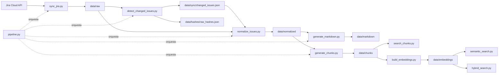

# RAG: extracción y búsqueda local de Jira

Pipeline read-only en Python que extrae tarjetas de Jira Cloud, detecta cambios,
normaliza su contenido y genera documentos y chunks preparados para búsqueda
literal, semántica e híbrida.

El proyecto mantiene los datos localmente y conserva trazabilidad desde cada
resultado hasta la tarjeta original de Jira.

> La integración con Jira solo realiza solicitudes HTTP `GET`. No crea, edita
> ni elimina tarjetas.

## Capacidades

- Sincronización completa o incremental de un proyecto Jira.
- Descarga del detalle completo, campos, comentarios y changelog.
- Detección de tarjetas nuevas o modificadas mediante SHA-256.
- Normalización de respuestas Jira a un contrato JSON estable.
- Generación de un documento Markdown legible por tarjeta.
- Generación de chunks temáticos con metadata para RAG.
- Construcción de embeddings locales con un modelo multilingüe.
- Búsqueda literal, semántica e híbrida con filtros.
- Logs JSON por cada ejecución del pipeline.
- Scripts auxiliares para descubrir campos y estructuras de Jira.

La explicación individual de cada programa está en
[`SCRIPTS.md`](SCRIPTS.md).

## Arquitectura



`pipeline.py` ejecuta sincronización, detección de cambios, normalización,
Markdown y chunks. La construcción de embeddings es deliberadamente un paso
separado, porque puede ser más costosa y requiere descargar/cargar un modelo.

## Requisitos

- Python 3.10 o superior.
- Acceso de lectura a una instancia de Jira Cloud.
- Correo de usuario y API token de Jira.
- Espacio local para los datos extraídos y el modelo de embeddings.
- Acceso a internet durante la primera carga del modelo
  `sentence-transformers/paraphrase-multilingual-MiniLM-L12-v2`.

## Instalación

En Windows PowerShell:

```powershell
python -m venv .venv
.\.venv\Scripts\Activate.ps1
pip install -r requirements.txt
```

En Linux o macOS:

```bash
python3 -m venv .venv
source .venv/bin/activate
pip install -r requirements.txt
```

Las dependencias directas son:

| Librería | Uso |
|---|---|
| `requests` | Consultas read-only a Jira |
| `python-dotenv` | Carga de configuración desde `.env` |
| `sentence-transformers` | Modelo para embeddings y consultas semánticas |
| `numpy` | Persistencia y cálculo sobre vectores |
| `truststore` | Disponible para integración con certificados del sistema |

## Configuración

Crear un archivo `.env` en la raíz del repositorio:

```dotenv
JIRA_BASE_URL=https://tu-organizacion.atlassian.net
JIRA_EMAIL=usuario@empresa.com
JIRA_API_TOKEN=tu_api_token
JIRA_PROJECT_KEY=PE20
```

| Variable | Obligatoria | Descripción |
|---|:---:|---|
| `JIRA_BASE_URL` | Sí | URL base de Jira, preferentemente sin `/` final |
| `JIRA_EMAIL` | Sí | Usuario usado para autenticación básica |
| `JIRA_API_TOKEN` | Sí | API token de Jira |
| `JIRA_PROJECT_KEY` | Sí | Key del proyecto que se sincroniza |

`.env` y todo el directorio `data/` están ignorados por Git. Los archivos raw,
normalizados, documentos, chunks, embeddings y logs pueden contener información
sensible del proyecto.

## Inicio rápido

### 1. Extraer y procesar Jira

Primera carga o actualización de las tarjetas más recientes:

```powershell
python scripts/pipeline.py --mode full --max-results 100
```

Actualización desde la última sincronización exitosa:

```powershell
python scripts/pipeline.py --mode incremental --max-results 100
```

Incremental desde una fecha o período manual:

```powershell
python scripts/pipeline.py --mode incremental --since "-1d" --max-results 100
python scripts/pipeline.py --mode incremental --since "2026-06-01" --max-results 100
```

### 2. Buscar por coincidencia literal

La búsqueda literal funciona directamente sobre `data/chunks/`:

```powershell
python scripts/search_chunks.py "error autenticación"
python scripts/search_chunks.py "token" --status "Finalizada" --limit 5
```

### 3. Construir el índice semántico

Ejecutar este paso después de la primera generación de chunks y cada vez que se
quiera incorporar al índice semántico el contenido modificado:

```powershell
python scripts/build_embeddings.py
```

El comando carga todos los chunks disponibles y reemplaza el índice completo.

### 4. Buscar semántica o híbricamente

```powershell
python scripts/semantic_search.py "problemas para iniciar sesión" --limit 5
python scripts/hybrid_search.py "problemas para iniciar sesión" --limit 5
```

La búsqueda híbrida combina similitud semántica y coincidencia literal. Sus
pesos por defecto son `0.65` y `0.35`:

```powershell
python scripts/hybrid_search.py "PE20-1034 login" `
  --semantic-weight 0.4 `
  --literal-weight 0.6
```

## Pipeline principal

```text
sync_jira.py
  -> detect_changed_issues.py
  -> normalize_issues.py
  -> generate_markdown.py
  -> generate_chunks.py
```

| Argumento | Valores | Default | Descripción |
|---|---|---:|---|
| `--mode` | `full`, `incremental` | Obligatorio | Tipo de sincronización |
| `--max-results` | Entero | `20` | Máximo de tarjetas solicitadas a Jira |
| `--since` | Fecha JQL o período relativo | Automático | Inicio manual del incremental |
| `-h`, `--help` | - | - | Ayuda del comando |

En modo incremental, el punto de inicio se elige así:

1. Usa `--since` si fue informado.
2. Usa `last_successful_sync` de `data/sync/sync_state.json`.
3. Usa `-1d` si todavía no existe un estado previo.

Cada paso se ejecuta con el mismo intérprete de Python que inició el pipeline.
Si uno falla, los pasos siguientes no se ejecutan. El resultado, tiempos,
`stdout` y `stderr` quedan registrados en `data/logs/pipeline_<run_id>.json`.

## Búsquedas

Los tres buscadores aceptan una consulta posicional y estos filtros exactos:

| Filtro | Ejemplo |
|---|---|
| `--limit` | `--limit 5` |
| `--status` | `--status "Finalizada"` |
| `--sprint` | `--sprint "MAY-26B"` |
| `--issue-key` | `--issue-key "PE20-1034"` |
| `--chunk-type` | `--chunk-type "description"` |

### Literal

`search_chunks.py` normaliza mayúsculas y acentos, elimina stopwords y puntúa
coincidencias en texto y metadata. Da prioridad extra a título, key de Jira y
ticket GLPI. No requiere embeddings.

```powershell
python scripts/search_chunks.py "incidente pagos" --chunk-type description
```

### Semántica

`semantic_search.py` codifica la consulta con el mismo modelo usado para crear el
índice y ordena los chunks por similitud coseno.

```powershell
python scripts/semantic_search.py "fallas relacionadas con permisos"
```

### Híbrida

`hybrid_search.py` normaliza por separado los scores semánticos y literales, y
luego calcula una suma ponderada.

```powershell
python scripts/hybrid_search.py "GLPI 123456 permisos" --issue-key PE20-1034
```

Los pesos no se validan ni normalizan automáticamente; para una interpretación
clara conviene que sumen `1`.

## Estructura

```text
rag/
|-- scripts/
|   |-- pipeline.py
|   |-- sync_jira.py
|   |-- detect_changed_issues.py
|   |-- normalize_issues.py
|   |-- generate_markdown.py
|   |-- generate_chunks.py
|   |-- build_embeddings.py
|   |-- search_chunks.py
|   |-- semantic_search.py
|   |-- hybrid_search.py
|   |-- jira_discovery.py
|   `-- jira_full_discovery.py
|-- data/
|   |-- raw/
|   |-- normalized/
|   |-- markdown/
|   |-- chunks/
|   |-- embeddings/
|   |-- fields/
|   |-- hashes/
|   |-- sync/
|   `-- logs/
|-- .env
|-- .gitignore
|-- requirements.txt
|-- SCRIPTS.md
`-- README.md
```

## Artefactos generados

| Ruta | Contenido |
|---|---|
| `data/raw/<KEY>.json` | Respuesta completa de Jira por tarjeta |
| `data/normalized/<KEY>.json` | Contrato simplificado por tarjeta |
| `data/markdown/<KEY>.md` | Documento legible y trazable |
| `data/chunks/<KEY>.json` | Lista de chunks temáticos |
| `data/embeddings/chunk_embeddings.npy` | Matriz NumPy de embeddings normalizados |
| `data/embeddings/chunks_index.json` | Snapshot ordenado de chunks asociado a la matriz |
| `data/fields/jira_fields.json` | Catálogo de campos obtenido por discovery |
| `data/hashes/raw_hashes.json` | Hash actual de cada raw |
| `data/sync/changed_issues.json` | Keys nuevas o modificadas |
| `data/sync/sync_state.json` | Estado de la última sincronización exitosa |
| `data/logs/pipeline_<run_id>.json` | Registro completo de una corrida |

## Contrato normalizado

Cada archivo de `data/normalized/` tiene esta forma general:

```json
{
  "issue_key": "PE20-1234",
  "title": "Título de la tarjeta",
  "issue_type": "Task",
  "status": "Finalizada",
  "priority": "Medium",
  "sprint": "Sprint 42",
  "glpi_ticket": "123456",
  "focus_area": "Módulo",
  "assignee": "Nombre Apellido",
  "reporter": "Nombre Apellido",
  "creator": "Nombre Apellido",
  "resolved_by_inferred": "Nombre Apellido",
  "created_at": "2026-06-01T10:00:00.000+0000",
  "updated_at": "2026-06-10T12:00:00.000+0000",
  "resolved_at": "2026-06-10T11:00:00.000+0000",
  "description": "Descripción en texto plano",
  "labels": [],
  "components": [],
  "comments": [],
  "attachments": [],
  "issue_links": [],
  "subtasks": [],
  "history": [],
  "jira_url": "https://tu-organizacion.atlassian.net/browse/PE20-1234",
  "raw_file": "data/raw/PE20-1234.json"
}
```

La normalización conoce tres campos custom de la instancia actual:

| Dato | Campo Jira |
|---|---|
| Sprint | `customfield_10020` |
| Ticket GLPI | `customfield_10270` |
| Área de enfoque | `customfield_10237` |

Si los IDs cambian, usar `jira_discovery.py` para encontrarlos y actualizar
`normalize_issues.py`.

## Formato de chunks

Los tipos actuales son `general`, `description`, `comment_<n>`, `attachments`,
`history`, `issue_links` y `subtasks`. Las secciones opcionales solo se crean
cuando tienen contenido.

```json
{
  "id": "PE20-1234::description",
  "issue_key": "PE20-1234",
  "chunk_type": "description",
  "text": "Tarjeta PE20-1234 - Título...",
  "metadata": {
    "issue_key": "PE20-1234",
    "title": "Título de la tarjeta",
    "status": "Finalizada",
    "sprint": "Sprint 42",
    "glpi_ticket": "123456",
    "jira_url": "https://tu-organizacion.atlassian.net/browse/PE20-1234",
    "chunk_type": "description"
  }
}
```

## Discovery de Jira

Antes de adaptar el pipeline a otra instancia puede ser útil ejecutar:

```powershell
python scripts/jira_discovery.py
python scripts/jira_full_discovery.py
```

El primero valida la conexión, guarda el catálogo de campos y descarga una
muestra de 10 tarjetas. El segundo descarga el detalle completo de las 20
tarjetas más recientes.

> `jira_discovery.py` guarda respuestas parciales en el mismo `data/raw/` usado
> por el pipeline y puede sobrescribir tarjetas existentes. Después de usarlo,
> conviene ejecutar nuevamente una sincronización normal.

## Operación y diagnóstico

```powershell
# Ver ayuda
python scripts/pipeline.py --help

# Revisar el estado del sync
Get-Content data/sync/sync_state.json

# Revisar qué tarjetas cambiaron
Get-Content data/sync/changed_issues.json

# Ver el último log
Get-ChildItem data/logs/pipeline_*.json |
  Sort-Object LastWriteTime -Descending |
  Select-Object -First 1 |
  Get-Content
```

Problemas frecuentes:

- **Faltan variables en `.env`:** comprobar las cuatro variables obligatorias.
- **401 Unauthorized:** revisar correo, token y organización.
- **403 Forbidden:** revisar permisos de lectura del usuario.
- **No se regeneran salidas:** si `changed_issues.json` contiene `[]`, no hubo
  cambios detectados.
- **No existe índice de embeddings:** ejecutar `build_embeddings.py`.
- **Resultados semánticos desactualizados:** reconstruir embeddings después de
  modificar chunks.
- **Primera búsqueda semántica lenta:** el modelo debe descargarse y cargarse.

## Seguridad y limitaciones

- Las consultas a Jira son read-only, pero actualmente usan `verify=False` por
  compatibilidad con un certificado corporativo. En producción debe habilitarse
  la validación SSL correctamente.
- `--max-results` limita cada búsqueda; no hay paginación completa.
- Los campos custom dependen de IDs concretos de una instancia.
- La detección de cambios compara archivos raw completos.
- No se eliminan automáticamente salidas antiguas de tarjetas borradas.
- La inferencia de quién resolvió una tarjeta depende del changelog y de una
  lista conocida de estados finales.
- Los adjuntos se documentan mediante metadata y URL, pero no se descargan ni
  analizan.
- `jira_discovery.py` puede sobrescribir raws completos con respuestas parciales
  de su búsqueda de muestra.
- El resumen incluido en Markdown es determinístico y no llama a un modelo.
- El pipeline no reconstruye automáticamente el índice de embeddings.
- Los buscadores cargan todos los chunks o embeddings en memoria y no aplican
  un umbral mínimo de relevancia.
- No hay tests automatizados actualmente.

## Contribución

1. Mantener todas las operaciones de Jira en modo read-only.
2. No versionar `.env` ni contenidos de `data/`.
3. Documentar cambios en contratos, campos custom o artefactos.
4. Verificar los modos `full` e `incremental`.
5. Reconstruir embeddings cuando cambie la lógica o el contenido de chunks.
